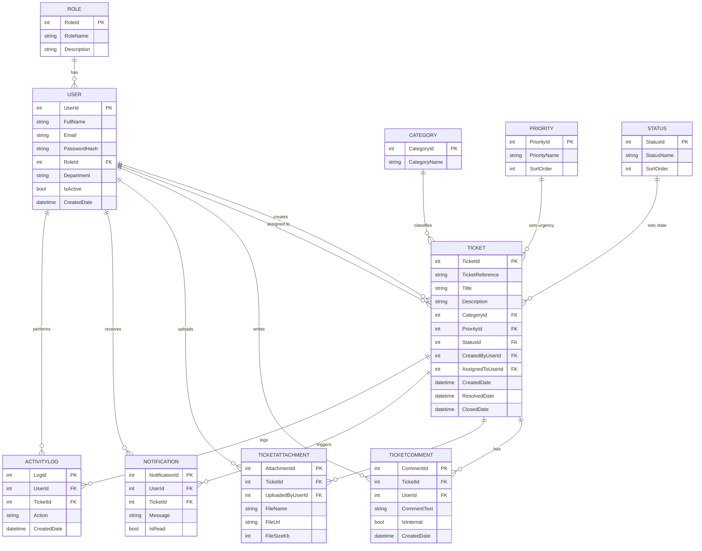

# Entity Relationship Diagram — IT Help Desk & Ticketing System

Table names are singular per the SQL Server Standards (Rule 1a). Paste this into [Mermaid Live Editor](https://mermaid.live) or view it directly on GitHub.

## Design notes

- **Ticket** is the central table — every other table either feeds into it (Category, Priority, Status) or references it (TicketComment, TicketAttachment, Notification, ActivityLog).
- `AssignedToUserId` on Ticket is nullable — a ticket starts unassigned until an agent picks it up or an admin assigns it. This is the exception case in Rule 2b (Foreign Key Fields): two FKs to the same parent table (`User`) get descriptive prefixes (`CreatedByUserId`, `AssignedToUserId`) instead of both being called `UserId`.
- `IsInternal` on TicketComment distinguishes private agent notes from replies visible to the employee.
- `SortOrder` on Priority and Status lets the UI sort dropdowns and badges consistently without hardcoding string comparisons.
- `User` is wrapped in brackets (`[User]`) in the actual SQL because `USER` is a reserved word in T-SQL — this only affects the physical table name, not the naming convention itself.
- Indexes exist on `Ticket.StatusId`, `Ticket.AssignedToUserId`, and `Ticket.CreatedByUserId` (see schema.sql) since these are the most common filter/search columns for the dashboard.
