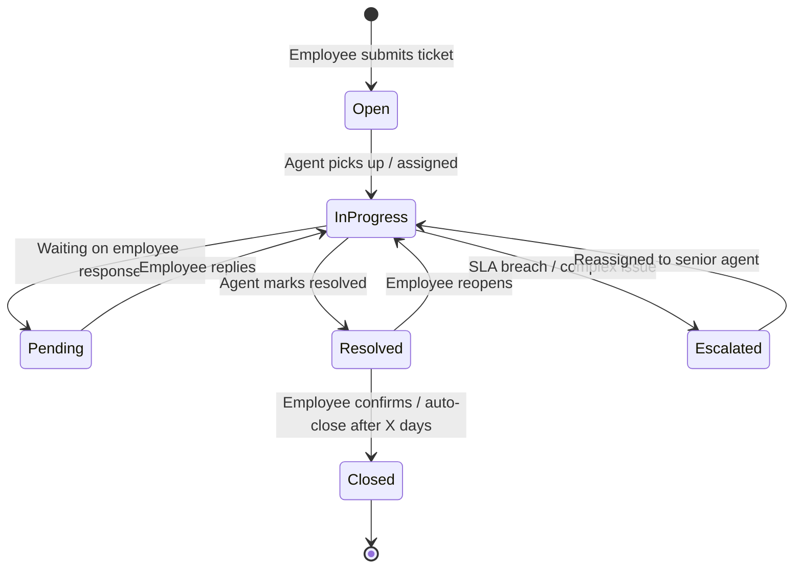
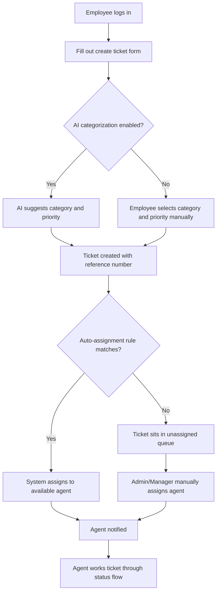
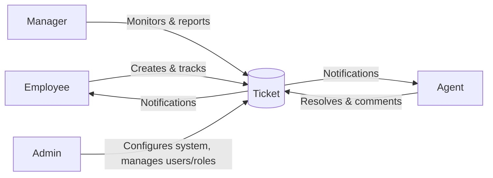

# System Workflow Diagrams

## 1. Ticket lifecycle (status flow)

## 2. Ticket submission and assignment workflow

## 3. Role interaction overview

## Notes

- The **Escalated** state in the lifecycle maps to the "Escalation workflow" feature in the spec — triggered either manually by an agent or automatically on SLA breach (if SLA reports are implemented).
- Auto-assignment (workflow 2) is listed as optional in the spec ("Manual or automatic assignment") — build manual assignment first in Week 3, then layer in auto-assignment rules if time allows.
- All state transitions should write a row to `ActivityLogs` for the audit trail requirement.
